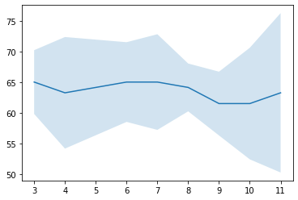
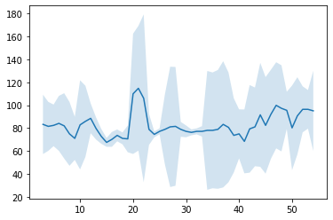

## Week 1
* Create group chat
* Create github repo to track code/logs
* Visit [LASER World of PHOTONICS](https://world-of-photonics.com/en/) exhibition in Munich, research currently available sensors related to the project (3 hours) -- suprisingly, nothing of close resemblence was discovered. Biophotonics stands number was frustratingly low 🥺. 
* Research how the remote heart rate estimation is done - photoplethysmography (Remote-PPG) (~1 hour). 
* Explore the [state-of-the-art algrithms list](https://paperswithcode.com/task/heart-rate-estimation) (2 hours so far, in progress)
  * [Latest method](https://paperswithcode.com/paper/efficient-deep-learning-based-estimation-of). Uses images from frontal smartphone camera for heartate and SpO2 estimation. No code released yet. Will contact the paper authors.
  * [Deployable method](https://github.com/terbed/Deep-rPPG) - coulb be run on Nvidia Jetson nano (have to check performance).

## Week 2
* Contacted Taha Samavati regarding code for [method](https://paperswithcode.com/paper/efficient-deep-learning-based-estimation-of) from previous week. Got a positive answer. Will test the model this week.
* Read papers, presenting latest methods in heart rate estimation (7 hours): 
  * [Self-supervised Representation Learning Framework for Remote Physiological Measurement Using Spatiotemporal Augmentation Loss](https://arxiv.org/pdf/2107.07695v2.pdf)
    * comment: self-supervised method is not deployable.
  * [A Review of Deep Learning-Based Contactless Heart Rate
Measurement Methods](https://www.mdpi.com/1424-8220/21/11/3719/pdf).
    * comment: recent review paper. useful to understand the current field.
  * [Instantaneous Physiological Estimation using Video Transformers](https://arxiv.org/pdf/2202.12368v1.pdf)
    * comment: promising model, rgb input. plan to test this model next. [repo](https://github.com/revanurambareesh/instantaneous_transformer).
    * started running the docs to understand how to run the code. imported github repo to colab 
    * the requierements.txt and model weights are missing. Need to consult authors.
  * [Beat-to-Beat Cardiac Pulse Rate Measurement From Video](https://openaccess.thecvf.com/content/ICCV2021W/V4V/papers/Hill_Beat-To-Beat_Cardiac_Pulse_Rate_Measurement_From_Video_ICCVW_2021_paper.pdf)
    * comment: method participated in V4V challenge in Fall 21. no code released. will contact authors.  MAE 9.37 beats/min, faster inference. 
  * [Automatic region-based heart rate measurement using remote
photoplethysmography](https://openaccess.thecvf.com/content/ICCV2021W/V4V/papers/Kossack_Automatic_Region-Based_Heart_Rate_Measurement_Using_Remote_Photoplethysmography_ICCVW_2021_paper.pdf)
    * comment: method participated in V4V challenge in Fall 21.

## Week 3

* Probably useful later: [Arduino lib](https://github.com/oxullo/Arduino-MAX30100) for Maxim Integrated MAX30100 oximetry / heart rate sensor.
* Task of the week: get at least one Deep Learning model inference running.
* The most developed framework found so far: [Paper](https://www.ncbi.nlm.nih.gov/pmc/articles/PMC9044207/), [Repo](https://github.com/phuselab/pyVHR)
* Tried to run on Macbook: stuck at *Unsupported hardware* error :( (2 hours)
* Got results on [Colab](https://github.com/androbaza/Xsight-heart-rate/blob/main/resources/notebooks/XSight_pyVHR.ipynb)! (3 hours). Left figure: video from laptop webcam, sitting still. Right figure: sitting still in the beginning and then doing squats for a minute.

## Week 4

* Working with pyVHR on Colab is not efficient due to mandatory libs installation of 40-60 minutes every time. Sometimes the process is stuck. Lost of troubleshooting (3 hours spent, no real work progress)
* Read about Jetson Nano workflow (1.5 hours)
* Work on further project plan:
    * install ubuntu on jetson nano. (1-2 hours, finish before 21.05) 
    * install [pyVHR](https://github.com/phuselab/pyVHR) libs, and [Deep-rPPG](https://github.com/terbed/Deep-rPPG). (up to several days, finish before 25.05)
    * compare the stability of the two frameworks, chose the one to stick around with. (up to several days, finish before 29.05)
    * connect the camera to Jetson nano, learn to acquire a short video from it by pressing a button. (3-4 hours, finish before 01.06)
    * create pipeline for video feeding to the selected framework. (up to several days, finish before 08.06)
    * learn to read the framework output as text. connect screen, format the output to be corretly displayed. (finish before 15.06)
    * ----------------- MVP point - further developments are aimed at optimization ----------------
    * make the pipeline live.
      * estimate the minimal video length, at which the accuracy is adequate.

## Week 5
* While waiting for Haseeb to finish with the remote acceess setup on Jetson, I'll start with the "video recording and feeding to algorithm" pipeline (research, 3 hours).
* Pushbutton is easily connected to the Jetson: [video](https://www.youtube.com/watch?v=ehzrPl5cNCc), [tutorial](https://jetsonhacks.com/2015/12/29/gpio-interfacing-nvidia-jetson-tx1/). -- could have the button on on the jetson board itself 
* Reading Camera input [GStreamer tutorial (official method)](https://developer.ridgerun.com/wiki/index.php?title=GStreamer_Daemon_-_MP4_Video_Recording),
* [CV2 python code for short video recording to try](https://github.com/aarushi-nema/jetson-nano/blob/master/openCV003_save_read.py)).
* Very nice project for remote temperature measurement on Jetson nano [repo](https://github.com/tomek-l/ai-thermometer) -- bits and pieces could be useful.

## Week 6
* For some reason the Jetson nano refuses the connection via NoMachine for remote access. Troubleshooting (2h). Haseeb will set it up at Lichtwerkstatt for physical access.
* Looked more closely through [temperature measurement project](https://github.com/tomek-l/ai-thermometer) methods to understand the interacton with jetson hardware (2h).
    * Particularly interesting is [camera interaction scripts](https://github.com/tomek-l/ai-thermometer/blob/master/docs/camera_scripts/gstreamer_commands.md)
    * [Notebooks](https://github.com/tomek-l/ai-thermometer/tree/master/docs/notebooks) provide nice step-by-step guides on running a model similar to ours. 
    
## Week 7
* Meeting with Xsight team, discussuon of design ideas (1.5h)
* Safety training to have direct access to Lichwerkstatt with my transponder (1h)
* Next steps of my work should be offline in the Lichwerkstatt, as I need to have direct access to Jetson nano. Hovewer, this week I could not fit this work into my schedule due to multiple urgent responsibilities (looking for an apartment, preparing for midterms, preparting for presentations in other subjects). I will "reimburse" the time to the project as I get these urgent matters solved. The nice thing is that other members of the team do not rely on results of my work (yet), as we are working in parallel.

## Week 8
* Created [main loop](https://github.com/androbaza/Xsight-heart-rate/tree/main/resources/main_loop) with function for video capturing from the camera. Not tested yet, probably needs lots of debugging --> will check it as I get hands-on with Jetson. (5h)
* Pushbutton connection scheme is attached below and the [code to run and finish the main loop was written](https://github.com/androbaza/Xsight-heart-rate/blob/main/resources/main_loop/main.py#L39).
   * Required: 1kOhm resistor, connect one leg of resistor to 3.3V through pushbutton leg, another leg to GND.
   * After the loop is run (need to think about how to enter it), wait for the button push, and enter video recording/inference state. 
   * Possible problem: need another button to control on/off state of the "inference button loop". Need to discuss this with the team for the device operation to be logical.
   

## Week 9
* ~~Spent the whole week praying for Haseeb to get well (168h)~~ 
    * We decided on meeting with Haseeb during the week, but he was feeling sick at the morning of meeting days. 
    * I need to meet him at Lichtwerkstatt to test my code at the Jetson setup. I am cautious to write more code before testing it because it could be in vain. Hopefully we could do it this Thursday after lecture.
* We had a small discussion regarding the code logic and design with the team and Xsight Optics at Lichtwerkstatt (1h).
    * Decided that there will be 2 buttons: one for on/off and one for entering the video recording/inference loop.
    * I will connect the buttons and test the implementations as soon as I get my hand on Jetson.
* Research on how to run certain file on button press on Jetson (1h)
   * Decided to put the main loop on autorun in Jetson's OS. Probably need a LED (or show info on screen) to signal the user that the device is ready to take measurements.
* Wrote the [function for video capture and saving](https://github.com/androbaza/Xsight-heart-rate/blob/main/resources/main_loop/camera_capture.py). Should be pretty universal, whatever camera we will end up using. (2h)

## Week 10
* Cleaned up the main loop, started research on how to connect the display to Jetson nano and program it. (3h)
    * [Useful tutorial](https://github.com/JetsonHacksNano/installPiOLED)
